<p align="center">
  
</p>

<p align="center">
  <a href="https://github.com/sheranton/pe-walker/actions/workflows/ci.yml"></a>
  <a href="https://github.com/sheranton/pe-walker/releases/latest"></a>
  
  
  <a href="LICENSE"></a>
</p>

<p align="center">
  <sub><b>Toolkit:</b> <b>pe-walker</b> · <a href="https://github.com/sheranton/pe-diff">pe-diff</a> · <a href="https://github.com/sheranton/rtti-dump">rtti-dump</a> · <a href="https://github.com/sheranton/vtable-dump">vtable-dump</a> · <a href="https://github.com/sheranton/pattern-scan">pattern-scan</a> · <a href="https://github.com/sheranton/unwind-map">unwind-map</a></sub>
</p>

`pe-walker` prints the structure of a Portable Executable (`.exe`, `.dll`, `.sys`): the DOS and NT headers, the optional header, the section table, and every imported and exported function. It is a quick-look tool for when you want the layout of a binary without opening a full reverse engineering suite, and a readable reference implementation for anyone learning PE/COFF.

<p align="center">
  
</p>

## Highlights

- **32- and 64-bit images:** both optional header layouts, and both thunk formats for name and ordinal imports.
- **Runs anywhere:** the PE structures are defined in a portable header (`src/pe_format.hpp`), with no dependency on `<windows.h>`, so it analyses Windows binaries on Linux and macOS too.
- **Safe on hostile input:** every header, table and string read is bounds-checked against the file, and a malformed binary produces an error instead of a crash.
- **Readable timestamps:** `TimeDateStamp` is decoded to UTC. Reproducible (`/Brepro`) builds store a content hash there, so expect odd dates for those.
- **Color in a terminal:** headings, addresses, decoded names, sections and DLLs are colored on a terminal, and piped output stays plain.
- **Small and dependency-free:** one C++17 source file plus the portable PE header.

## Example

Real output for the test fixture in [`tests/fixtures`](tests/fixtures), an x64 DLL built from `sample.cpp`:

```console
$ pe-walker sample64.dll
DOS header
  e_magic   : 0x5a4d ('MZ')
  e_lfanew  : 0x00000100
File header
  machine        : x64 (AMD64) (0x8664)
  sections       : 5
  timestamp      : 0xe452c1a9 (2091-05-21 23:32:57 UTC)
  symtab offset  : 0x00000000
  characteristics: 0x2022
Optional header
  entry point    : 0x0000177c
  image base     : 0x0000000180000000
  section align  : 0x00001000
  file align     : 0x00000200
  subsystem      : Windows GUI (2)
  dll chars      : 0x0160
  size of image  : 0x00008000
  size of headers: 0x00000400
Sections (5)
  name       virt_size  virt_addr   raw_size raw_offset characteristics
  .text     0x00001358 0x00001000 0x00001400 0x00000400 0x60000020
  .rdata    0x0000183c 0x00003000 0x00001a00 0x00001800 0x40000040
  .data     0x00000338 0x00005000 0x00000400 0x00003200 0xc0000040
  .pdata    0x0000024c 0x00006000 0x00000400 0x00003600 0x40000040
  .reloc    0x000000a0 0x00007000 0x00000200 0x00003a00 0x42000040
Imports
  KERNEL32.dll
      QueryPerformanceCounter
      GetCurrentProcessId
      ...
  VCRUNTIME140.dll
      __C_specific_handler
      _CxxThrowException
      ...
Exports (3 by name, 3 by ordinal)
  [   1] sample_area
  [   2] sample_make
  [   3] sample_node_id
```

## Install

Download a prebuilt binary for Windows x64, Linux x64 (statically linked) or macOS arm64 from the [latest release](https://github.com/sheranton/pe-walker/releases/latest), or build from source with CMake 3.15+ and any C++17 compiler (MSVC, MinGW-w64, GCC, Clang):

```sh
cmake -S . -B build -DCMAKE_BUILD_TYPE=Release
cmake --build build --config Release
ctest --test-dir build -C Release      # optional: run the test suite
```

## Usage

```text
pe-walker [--summary|-s] [--color auto|always|never] <file.exe|file.dll>
```

| Flag | Effect |
|---|---|
| `--summary`, `-s` | Print the headers and section table only, without the import and export lists. |
| `--color WHEN` | `auto` (default) colors output only on a terminal; `always` and `never` force it. Setting `NO_COLOR` turns colors off. |

Exit status is `0` on success, `1` for an unreadable or malformed file, and `2` for a usage error.

## How it works

<p align="center">
  
</p>

Every section has two locations: its raw offset and size in the file, and its RVA and virtual size once the loader maps it. pe-walker reads both from the section table and uses them to translate the RVAs found in the import and export directories into file offsets.

## What it covers

| Structure | Details |
|---|---|
| `IMAGE_DOS_HEADER` | magic, `e_lfanew` |
| `IMAGE_FILE_HEADER` | machine (x86, x64, ARM, ARM64, Itanium), section count, timestamp, characteristics |
| `IMAGE_OPTIONAL_HEADER32/64` | entry point, image base, alignments, subsystem, DLL characteristics, sizes |
| `IMAGE_SECTION_HEADER` | name, virtual and raw layout, characteristics |
| Import directory | every DLL with its functions, by name or by ordinal |
| Export directory | named exports with their ordinals |

Not covered yet: resources (`.rsrc`), base relocations, TLS callbacks, the debug directory and PDB info, delay-load imports, and Authenticode signatures.

## Testing

- **Golden tests:** `ctest` runs the tool against x64 and x86 fixture DLLs, plain and colored, and compares the output byte for byte with [`tests/expected`](tests/expected). The fixtures are built from source with [`tests/fixtures/build.cmd`](tests/fixtures/build.cmd).
- **CI:** builds and tests on Windows (MSVC), Linux (GCC) and macOS (Clang) on every push, plus a MinGW-w64 cross-build.
- **Portable-header regression:** when the code moved from `<windows.h>` to the portable header, its output was checked byte for byte against the previous build on 500 binaries from `System32` and `SysWOW64`. There were no differences.

## See also

- [pe-diff](https://github.com/sheranton/pe-diff) compares two PE files using the same parsing.
- [rtti-dump](https://github.com/sheranton/rtti-dump) and [vtable-dump](https://github.com/sheranton/vtable-dump) recover C++ classes from MSVC binaries.

## License

MIT, see [LICENSE](LICENSE).
